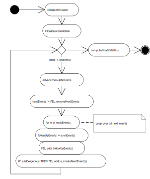

# OES Python Core 0 Simulator 

The OESpy Core 0 simulator implements a minimal architecture for Object Event Simulation (OES), supporting models with 
(global) model variables and functions, object types, event types, and simple simulation experiments.

<figure><figcaption>The OES Core 0 information architecture</figcaption>
 
</figure>

<figure><figcaption>The OES Core 0 simulator algorithm</figcaption>
 
</figure>

# How to start application

Execute the command `mvn spring-boot:run` in root folder

Now you can navigate to http://localhost:8080 and choose one of the simulation available
