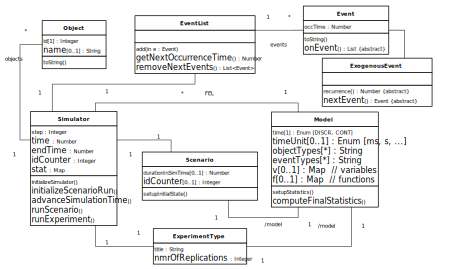
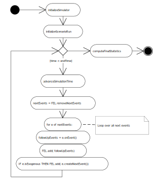

# OES Java Core 1 Simulator 

The OESjava Core 1 simulator implements a minimal architecture for Object Event Simulation (OES), supporting models with 
(global) model variables and functions, object types, event types, and simple simulation experiments.

<figure><figcaption>The OES Core 1 information architecture</figcaption>
 
</figure>

<figure><figcaption>The OES Core 1 simulator algorithm</figcaption>
 
</figure>

# How to start the simulation application

1. Run /start.sh script for creating a docker container with Postgres-DB
2. Execute the command `mvn spring-boot:run` in the root folder.

Now you can navigate to http://localhost:8080 and choose one of the available simulations.
