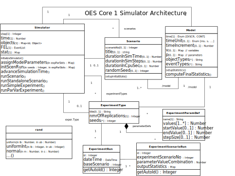

# Object Event Simulators 
This project provides various ***simulators*** (or *simulation engines*) for *Object Event Simulation (OES)*,
which is a *Discrete Event Simulation* paradigm combining object-oriented modeling with the simulation approach of 
*event scheduling*.

## OES Core 0

OES Core0 is the minimal architecture for an OE simulator, supporting  

- model variables 
- object types and event types (including exogenous event types with recurrence/nextEvent functions)
- next-event time progression
- the uniform distribution as the only representative of probability distributions
- simple simulation experiments with the (unseeded) random number generator provided by the host programming language.

## OES Core 1

OES Core1 adds the following features to OES Core0:

- fixed-increment time progression
- multiple scenarios per model
- multiple experiment types per model
- a seedable random number generator
- a set of probability distributions (uniform, triangular, normal, exponential, etc.)
- model parameters 
- parameter variation experiments
- experiment data storage

