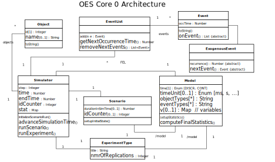

# Object Event Simulators 
This project provides various ***simulators*** (or *simulation engines*) for *Object Event Simulation (OES)*,
which is a *Discrete Event Simulation* paradigm combining object-oriented modeling with the simulation approach of 
*event scheduling*.

## OES Core 0

## OES Core 1
